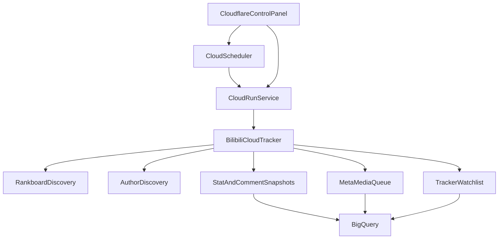

## Bilibili Cloud Tracker 部署说明

**Bilibili Cloud Tracker** 是一个运行在 `Google Cloud Run + Cloud Scheduler` 上的无状态周期服务，用于：

- 每隔固定时间抓取 15 个实时排行榜视频
- 周期性抓取一批精选作者的最新投稿
- 将新发现视频写入 `待追踪互动/评论清单` 与 `待补抓元数据/媒体队列`
- 对追踪期内视频持续追加互动快照和评论切片
- 在触发风控时自动暂停和退避，而不是持续高频重试

## 1. 架构概览



说明：

- `Cloud Scheduler` 只负责定时触发 HTTP 请求。
- `Cloud Run` 本身不做容器内自循环，因此更稳定，也更符合 Cloud Run 的推荐用法。
- 所有周期状态、作者列表、追踪清单和日志都持久化到 BigQuery。
- 媒体文件仍沿用现有 `Bilibili Video Data Crawler` 的 `GCS + BigQuery` 方案。
- 如需公网前端控制台，可在前面再接一层 `Cloudflare Workers + Cloudflare Access`。

## 2. 当前代码位置

- 新服务 Python 包：`src/bili_pipeline/cloud_tracker/`
- Cloud Run 镜像文件：`cloud_tracker/Dockerfile`
- 入口模块：`bili_pipeline.cloud_tracker.app:app`
- 对应的 Cloudflare 控制台项目：`cloud_panel/`
- Cloudflare 控制台部署文档：`Cloudflare_Control_Panel_Deployment.md`

## 3. 新增 BigQuery 控制表

服务启动时会自动确保以下控制表存在：

- `tracker_author_sources`
- `tracker_video_watchlist`
- `tracker_meta_media_queue`
- `tracker_run_control`
- `tracker_run_logs`

同时仍会沿用已有数据表：

- `videos`
- `video_stat_snapshots`
- `topn_comment_snapshots`
- `assets`
- `crawl_runs`
- `crawl_run_items`

## 4. 部署前准备

### 4.1 创建或确认 GCP 资源

至少需要：

- 一个 `GCP Project`
- 一个 `BigQuery Dataset`
- 一个 `GCS Bucket`
- 一个专用 `Service Account`

建议将新服务与已有 `Bilibili Video Data Crawler` 使用同一个 Dataset / Bucket，这样元数据、互动快照、评论快照与媒体资产都在同一套资源里。

### 4.2 需要的 IAM 权限

给 Cloud Run 使用的 Service Account 分配至少以下角色：

- `roles/bigquery.dataEditor`
- `roles/bigquery.jobUser`
- `roles/storage.objectAdmin`
- `roles/run.invoker`（若需要其他服务调用）
- `roles/secretmanager.secretAccessor`（若你把管理员 token 或 Cookie 放入 Secret Manager）

### 4.3 建议的 Cloud Run 服务配置

为了避免周期重叠和并发任务冲突，建议：

- `Max instances = 1`
- `Concurrency = 1`
- `Request timeout = 1800s`
- `CPU always allocated = off`
- `Min instances = 0`

其中：

- `Max instances = 1` 可以显著降低两个周期同时运行的概率
- `Concurrency = 1` 能避免同一容器同时处理多个触发请求
- 代码里仍实现了数据库锁，但平台侧限制依然建议保留

## 5. 环境变量

### 5.1 必填

- `GCP_PROJECT_ID`
- `BQ_DATASET`
- `GCS_BUCKET`
- `GCP_REGION`
- `TRACKER_ADMIN_TOKEN`

### 5.2 常用可选项

- `TRACKER_CRAWL_INTERVAL_HOURS`
- `TRACKER_TRACKING_WINDOW_DAYS`
- `TRACKER_COMMENT_LIMIT`
- `TRACKER_AUTHOR_BOOTSTRAP_DAYS`
- `TRACKER_MAX_VIDEOS_PER_CYCLE`
- `TRACKER_SNAPSHOT_WORKERS`
- `TRACKER_LOCK_TTL_MINUTES`
- `TRACKER_RISK_PAUSE_MINUTES`
- `TRACKER_RISK_PAUSE_MAX_MINUTES`
- `TRACKER_REQUEST_PAUSE_SECONDS`
- `TRACKER_STATUS_HISTORY_LIMIT`
- `TRACKER_TABLE_PREFIX`
- `TRACKER_RANKBOARD_CSV`

### 5.3 B 站 Cookie 可选项

如果你需要提升评论接口或视频接口成功率，可额外配置：

- `BILI_SESSDATA`
- `BILI_BILI_JCT`
- `BILI_BUVID3`

建议使用 Secret Manager 保存这些值，不要直接写死在命令行历史中。

## 6. 本地构建与镜像上传

以下命令在 `bilibili-data` 目录执行。

### 6.1 构建镜像

```bash
gcloud builds submit --tag gcr.io/<PROJECT_ID>/bilibili-cloud-tracker -f cloud_tracker/Dockerfile .
```

如果你使用 Artifact Registry，也可以改为：

```bash
gcloud builds submit --tag <REGION>-docker.pkg.dev/<PROJECT_ID>/<REPO>/bilibili-cloud-tracker -f cloud_tracker/Dockerfile .
```

## 7. 创建 Cloud Run 服务

示例：

```bash
gcloud run deploy bilibili-cloud-tracker \
  --image gcr.io/<PROJECT_ID>/bilibili-cloud-tracker \
  --region <REGION> \
  --platform managed \
  --service-account <SERVICE_ACCOUNT_EMAIL> \
  --allow-unauthenticated \
  --concurrency 1 \
  --max-instances 1 \
  --timeout 1800 \
  --set-env-vars GCP_PROJECT_ID=<PROJECT_ID>,BQ_DATASET=<BQ_DATASET>,GCS_BUCKET=<GCS_BUCKET>,GCP_REGION=<REGION>,TRACKER_CRAWL_INTERVAL_HOURS=2,TRACKER_TRACKING_WINDOW_DAYS=14,TRACKER_COMMENT_LIMIT=10 \
  --set-secrets TRACKER_ADMIN_TOKEN=<SECRET_NAME>:latest
```

如果你也想把 B 站 Cookie 放进 Secret Manager，可继续追加：

```bash
  --set-secrets BILI_SESSDATA=<SESSDATA_SECRET>:latest,BILI_BILI_JCT=<BILI_JCT_SECRET>:latest,BILI_BUVID3=<BUVID3_SECRET>:latest
```

说明：

- `TRACKER_CRAWL_INTERVAL_HOURS` 是服务内部配置，真正的触发频率仍由 Cloud Scheduler 控制
- 若需要服务只接受鉴权请求，可以不要 `--allow-unauthenticated`，改为让 Scheduler 带 OIDC 调用

## 8. 创建 Cloud Scheduler

### 8.1 推荐：使用 OIDC 调用 Cloud Run

```bash
gcloud scheduler jobs create http bilibili-cloud-tracker-2h \
  --location <REGION> \
  --schedule "0 */2 * * *" \
  --http-method POST \
  --uri "https://<CLOUD_RUN_URL>/run" \
  --oidc-service-account-email <SERVICE_ACCOUNT_EMAIL> \
  --oidc-token-audience "https://<CLOUD_RUN_URL>"
```

如果你保留了管理员 token 校验，还需要在 Scheduler 中加请求头：

```bash
--headers "Authorization=Bearer <TRACKER_ADMIN_TOKEN>"
```

更稳妥的做法是：

- Cloud Scheduler 用 OIDC
- 管理端手动调用时再加 `Authorization: Bearer ...`

### 8.2 首次可以先手动触发

```bash
gcloud scheduler jobs run bilibili-cloud-tracker-2h --location <REGION>
```

## 9. 首次初始化顺序

建议严格按以下顺序：

1. 先部署 Cloud Run 服务
2. 访问 `/healthz` 验证镜像可启动
3. 调用 `/admin/status` 确认 BigQuery 控制表已自动创建
4. 上传精选作者列表
5. 调整运行参数
6. 手动触发一次 `/run`
7. 检查 BigQuery 中是否产生新行
8. 再启用 Cloud Scheduler 定时任务

## 10. 管理接口

所有管理接口建议带：

```http
Authorization: Bearer <TRACKER_ADMIN_TOKEN>
```

### 10.1 上传作者列表

要求上传 CSV，必须包含 `owner_mid` 列。

```bash
curl -X POST "https://<CLOUD_RUN_URL>/admin/authors/upload" \
  -H "Authorization: Bearer <TRACKER_ADMIN_TOKEN>" \
  -F "file=@selected_authors.csv" \
  -F "source_name=selected_authors"
```

当前实现会以本次上传内容直接替换现有作者清单。

### 10.2 更新全局配置

```bash
curl -X POST "https://<CLOUD_RUN_URL>/admin/config/update" \
  -H "Authorization: Bearer <TRACKER_ADMIN_TOKEN>" \
  -H "Content-Type: application/json" \
  -d "{\"tracking_window_days\": 14, \"comment_limit\": 10, \"max_videos_per_cycle\": 1800}"
```

如果想手动清除暂停状态：

```bash
curl -X POST "https://<CLOUD_RUN_URL>/admin/config/update" \
  -H "Authorization: Bearer <TRACKER_ADMIN_TOKEN>" \
  -H "Content-Type: application/json" \
  -d "{\"clear_pause\": true}"
```

### 10.3 手动触发一次完整周期

```bash
curl -X POST "https://<CLOUD_RUN_URL>/run" \
  -H "Authorization: Bearer <TRACKER_ADMIN_TOKEN>"
```

如果当前正处于暂停窗口，但你仍然想人工强制跑一轮：

```bash
curl -X POST "https://<CLOUD_RUN_URL>/run?force=true" \
  -H "Authorization: Bearer <TRACKER_ADMIN_TOKEN>"
```

### 10.4 查看状态

```bash
curl "https://<CLOUD_RUN_URL>/admin/status" \
  -H "Authorization: Bearer <TRACKER_ADMIN_TOKEN>"
```

返回内容包括：

- 当前配置
- 当前暂停状态
- 当前锁状态
- 作者列表数量
- 活跃/已过期追踪视频数量
- 最近若干次运行记录

### 10.5 导出待抓元数据/媒体的视频列表

默认导出仍未完成 `meta` 或 `media` 的 `bvid` 列表：

```bash
curl "https://<CLOUD_RUN_URL>/admin/export/meta-media-queue" \
  -H "Authorization: Bearer <TRACKER_ADMIN_TOKEN>" \
  -o tracker_meta_media_queue.csv
```

如果你需要 JSON：

```bash
curl "https://<CLOUD_RUN_URL>/admin/export/meta-media-queue?format=json" \
  -H "Authorization: Bearer <TRACKER_ADMIN_TOKEN>"
```

### 10.6 导出当前互动/评论追踪清单

```bash
curl "https://<CLOUD_RUN_URL>/admin/watchlist?format=csv&only_active=true" \
  -H "Authorization: Bearer <TRACKER_ADMIN_TOKEN>" \
  -o tracker_watchlist.csv
```

## 11. 如何与现有 `Bilibili Video Data Crawler` 配合

推荐流程：

1. 让 `Bilibili Cloud Tracker` 长期维护 `tracker_meta_media_queue`
2. 定期从 `/admin/export/meta-media-queue` 导出待补抓 `bvid` 列表
3. 把该 CSV 继续交给现有 `Bilibili Video Data Crawler` 的批量流程处理元数据和媒体

这样可以做到：

- 动态互动/评论：由 Cloud Tracker 定时追加
- 元数据/媒体：仍由你现有、已验证稳定的 Crawler 批量处理

## 12. 上线后的验收清单

至少验证以下内容：

1. `GET /healthz` 返回 `200`
2. `GET /admin/status` 中能看到控制表已创建
3. 上传作者 CSV 后，`author_source_count` 正常增加
4. 第一次 `/run` 后，`tracker_video_watchlist` 与 `tracker_meta_media_queue` 有数据
5. `video_stat_snapshots` 与 `topn_comment_snapshots` 有新记录
6. 若某些视频已超出追踪窗口，会在 watchlist 中变为 `expired`
7. 导出的 `meta-media-queue` CSV 可被现有 `Bilibili Video Data Crawler` 直接使用

## 13. 风控与异常处理策略

当前实现会识别以下高风险错误标记：

- `352`
- `412`
- `429`
- `Too Many Requests`
- `Precondition Failed`
- 包含“风控”的错误文本

当命中这些错误时，服务会：

1. 立即停止继续高频抓取
2. 在 `tracker_run_control` 中写入 `paused_until`
3. 记录 `pause_reason`
4. 增加 `consecutive_risk_hits`
5. 后续 Scheduler 触发时先检查暂停窗口，若未到期则直接跳过

默认退避时间会指数增加，可通过环境变量调整：

- `TRACKER_RISK_PAUSE_MINUTES`
- `TRACKER_RISK_PAUSE_MAX_MINUTES`

## 14. 常见故障排查

### 14.1 `healthz` 返回 500

优先检查：

- Cloud Run 环境变量是否齐全
- `BQ_DATASET` / `GCS_BUCKET` 是否正确
- Service Account 是否有 BigQuery / GCS 权限

### 14.2 BigQuery 表未创建

检查：

- Service Account 是否有 `bigquery.dataEditor`
- `GCP_PROJECT_ID` 与 `BQ_DATASET` 是否填错
- Cloud Run 日志中是否有 dataset 创建失败信息

### 14.3 `/run` 很快返回 `paused`

说明当前处于自动风控退避窗口。先查看：

- `/admin/status`
- `pause_reason`
- `paused_until`

如需人工恢复，可调用配置更新接口并传 `{"clear_pause": true}`。

### 14.4 周期重叠

如果发现两个周期同时跑：

- 检查 Cloud Run 是否设置了 `max instances = 1`
- 检查 Cloud Run 是否设置了 `concurrency = 1`
- 检查 Cloud Scheduler 是否重复创建了多个任务

### 14.5 导出的 `meta-media-queue` 为空

常见原因：

- 当前发现视频都已经补抓过元数据和媒体
- 发现流程未正常执行
- `videos` / `assets` 表里已存在同一批 `bvid`

可先用 `/admin/status` 看本轮发现数量，再看 `tracker_meta_media_queue` 表是否有新行。

## 15. 建议的后续运维策略

- 每次修改环境变量后，先手动 `POST /run` 跑一轮再恢复 Scheduler
- 每周抽查一次 `tracker_run_logs`
- 当 watchlist 规模持续升高时，优先调低：
  - `TRACKER_MAX_VIDEOS_PER_CYCLE`
  - `TRACKER_SNAPSHOT_WORKERS`
- 当接口稳定后，再逐步调高批量规模

## 16. 一条推荐上线命令链

```bash
gcloud builds submit --tag gcr.io/<PROJECT_ID>/bilibili-cloud-tracker -f cloud_tracker/Dockerfile .

gcloud run deploy bilibili-cloud-tracker \
  --image gcr.io/<PROJECT_ID>/bilibili-cloud-tracker \
  --region <REGION> \
  --platform managed \
  --service-account <SERVICE_ACCOUNT_EMAIL> \
  --concurrency 1 \
  --max-instances 1 \
  --timeout 1800 \
  --allow-unauthenticated \
  --set-env-vars GCP_PROJECT_ID=<PROJECT_ID>,BQ_DATASET=<BQ_DATASET>,GCS_BUCKET=<GCS_BUCKET>,GCP_REGION=<REGION>,TRACKER_CRAWL_INTERVAL_HOURS=2,TRACKER_TRACKING_WINDOW_DAYS=14,TRACKER_COMMENT_LIMIT=10 \
  --set-secrets TRACKER_ADMIN_TOKEN=<SECRET_NAME>:latest

curl "https://<CLOUD_RUN_URL>/healthz"

curl -X POST "https://<CLOUD_RUN_URL>/admin/authors/upload" \
  -H "Authorization: Bearer <TRACKER_ADMIN_TOKEN>" \
  -F "file=@selected_authors.csv"

curl -X POST "https://<CLOUD_RUN_URL>/run" \
  -H "Authorization: Bearer <TRACKER_ADMIN_TOKEN>"

gcloud scheduler jobs create http bilibili-cloud-tracker-2h \
  --location <REGION> \
  --schedule "0 */2 * * *" \
  --http-method POST \
  --uri "https://<CLOUD_RUN_URL>/run"
```

## 17. 与 Cloudflare Control Panel 的关系

如果你希望后续让其他用户也能更快完成配置与部署，推荐再加一层 `Cloudflare Workers` 控制台：

- `Cloud Run Tracker`：负责真实抓取与写库
- `Cloud Scheduler`：负责定时触发
- `Cloudflare Control Panel`：负责前端管理、状态展示、导出和 Google Cloud 控制面操作

对应文档见：

- `Cloudflare_Control_Panel_Deployment.md`
