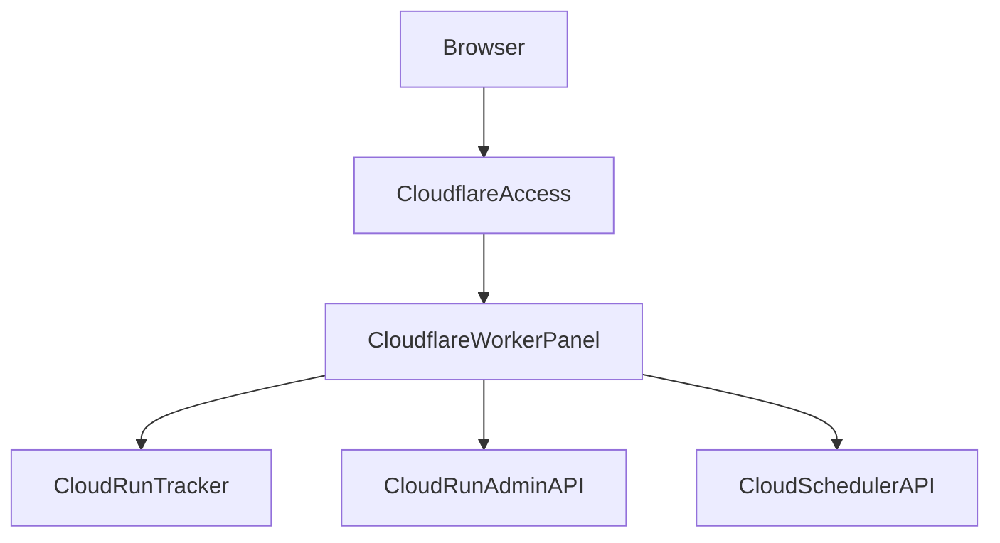

## Cloudflare Control Panel 部署说明

**Bilibili Cloud Control Panel** 是一个部署在 `Cloudflare Workers` 上的单租户公网控制台，用于管理你自己的：

- `Cloud Run` 上的 `Bilibili Cloud Tracker`
- `Cloud Scheduler` 定时任务
- `Cloud Tracker` 的运行时配置、导出接口和状态看板

它不负责直接抓取 B 站数据，真正的数据抓取仍由 `Cloud Run` 上的 `Bilibili Cloud Tracker` 完成。

## 1. 组件关系



## 2. 项目位置

- Workers 项目目录：`cloud_panel/`
- Worker 入口：`cloud_panel/src/index.js`
- Google API 鉴权逻辑：`cloud_panel/src/google.js`
- Tracker API 代理：`cloud_panel/src/tracker.js`
- 页面模板：`cloud_panel/src/ui.js`
- Wrangler 配置：`cloud_panel/wrangler.toml`

## 3. 功能概览

当前控制台已支持：

- Dashboard
  - Cloud Run 健康状态
  - Scheduler 状态
  - 正在追踪作者数
  - 当前活跃追踪视频数
  - 待抓元数据/媒体视频数
  - 互动快照总数与近 24h 增量
  - 评论快照总数与近 24h 增量
  - 最近运行日志
- Runtime Config
  - 更新 Cloud Run 环境变量
  - 更新 Tracker 运行时配置
- Control
  - 手动运行一次 Tracker
  - 强制运行一次 Tracker
  - 暂停 / 恢复 Tracker
  - 暂停 / 恢复 Scheduler
  - 上传精选作者 CSV
- Exports
  - 导出待抓元数据/媒体队列
  - 导出当前追踪清单
  - 导出作者清单
- Docs
  - 内置基础帮助页

## 4. 设计原则

### 4.1 单租户模板

本控制台按“每个用户自己部署一套”的方式设计：

- 每个用户拥有自己的 Worker
- 每个用户拥有自己的 Cloud Run Tracker
- 每个用户拥有自己的 Cloud Scheduler Job
- 每个用户将自己的 Google Service Account JSON 存入 Worker Secret

这样更适合你后续把项目分发给其他用户自行配置和部署。

### 4.2 通过 Cloudflare Access 做强鉴权

控制台虽然可公网访问，但不应该匿名开放。

推荐：

- 用 `Cloudflare Access / Zero Trust` 保护整个 Worker 路由
- 仅允许指定邮箱或指定身份源的用户访问
- Worker 内再通过 `CF-Access-Authenticated-User-Email` 做二次限制

### 4.3 “停止服务”的真实含义

控制台里的“停止/恢复”不建议直接删除或关闭 Cloud Run Service。

更合理的语义是：

- 暂停 `Cloud Scheduler Job`
- 或让 Tracker 进入 `pause` 状态

因为：

- `Cloud Run` 是按请求运行的无状态服务
- 真正控制周期任务是否继续发生的，是 Scheduler 与 Tracker 的 pause 配置

## 5. Cloudflare 准备工作

你需要：

- 一个 Cloudflare 账号
- 一个已接入 Cloudflare 的域名（推荐）
- 已开通 `Cloudflare Zero Trust / Access`
- Node.js 与 npm

## 6. 安装依赖

在 `bilibili-data/cloud_panel/` 目录执行：

```bash
npm install
```

## 7. Wrangler 配置

当前项目已包含：

```toml
cloud_panel/wrangler.toml
```

你需要根据自己的环境修改：

- `TRACKER_BASE_URL`
- `GCP_PROJECT_ID`
- `GCP_REGION`
- `CLOUD_RUN_SERVICE`
- `CLOUD_SCHEDULER_LOCATION`
- `CLOUD_SCHEDULER_JOB`

其中：

- `TRACKER_BASE_URL` 指向你已部署好的 `Cloud Run Tracker` 根地址
- `CLOUD_RUN_SERVICE` 是 Tracker 的 Cloud Run Service 名称
- `CLOUD_SCHEDULER_JOB` 是触发 Tracker 的 Scheduler Job 名称

## 8. 必需 Secret

使用 `wrangler secret put` 设置以下密钥。

### 8.1 Google Service Account JSON

```bash
wrangler secret put GOOGLE_SERVICE_ACCOUNT_JSON
```

粘贴完整的 Service Account JSON 内容。

这个服务账号至少需要：

- `roles/run.admin` 或能读取/更新目标 Cloud Run Service 的权限
- `roles/iam.serviceAccountUser`（如你的更新流程要求）
- `roles/cloudscheduler.admin` 或至少能读取/暂停/恢复目标 Scheduler Job 的权限

### 8.2 Tracker Admin Token

```bash
wrangler secret put TRACKER_ADMIN_TOKEN
```

这个值需要与 Cloud Run 上 `TRACKER_ADMIN_TOKEN` 保持一致。

### 8.3 可选：允许访问的邮箱列表

```bash
wrangler secret put CF_ACCESS_ALLOWED_EMAILS
```

可填：

```text
you@example.com,teammate@example.com
```

若不填写，Worker 会默认信任所有已经通过 Cloudflare Access 的用户。

## 9. Cloudflare Access 配置

建议保护整个 Worker 域名或对应路径。

推荐策略：

- Application Type: Self-hosted
- Domain: 你的 Worker 自定义域名
- Policy: 允许指定邮箱、GitHub 组织成员或 Google Workspace 成员访问

推荐至少开启：

- email 身份源
- Google / GitHub / 企业 IdP 之一

## 10. 本地开发

本地启动：

```bash
npm run dev
```

如果本地需要模拟环境变量，可先通过 Wrangler 的本地方式设置，或者临时在 `wrangler.toml` 中填入测试值。

## 11. 正式部署

```bash
npm run deploy
```

部署成功后，你会得到一个 Workers 域名，例如：

```text
https://bilibili-cloud-panel.<your-subdomain>.workers.dev
```

建议再绑定自定义域名，并由 Cloudflare Access 保护它。

## 12. 控制台依赖的后端接口

Worker 会调用以下现有 `Cloud Tracker` 接口：

- `GET /admin/status`
- `GET /admin/metrics`
- `GET /admin/run-logs`
- `GET /admin/authors`
- `GET /admin/watchlist`
- `GET /admin/export/meta-media-queue`
- `POST /admin/authors/upload`
- `POST /admin/config/update`
- `POST /run`

同时它还会调用：

- Google `Cloud Run Admin API`
- Google `Cloud Scheduler API`

## 13. 控制台 API 说明

Worker 对前端暴露的主要 API 如下：

- `GET /api/status`
- `GET /api/tracker/metrics`
- `GET /api/tracker/run-logs`
- `GET /api/tracker/authors`
- `POST /api/tracker/authors/upload`
- `POST /api/tracker/config`
- `POST /api/tracker/run`
- `POST /api/tracker/pause`
- `POST /api/tracker/resume`
- `GET /api/tracker/export/meta-media-queue`
- `GET /api/tracker/export/watchlist`
- `GET /api/tracker/export/authors`
- `GET /api/gcp/status`
- `GET /api/gcp/env`
- `POST /api/gcp/env`
- `GET /api/gcp/scheduler`
- `POST /api/gcp/scheduler/pause`
- `POST /api/gcp/scheduler/resume`

## 14. 环境变量与运行时配置的区别

控制台里有两类配置：

### 14.1 Cloud Run 环境变量

例如：

- `GCP_PROJECT_ID`
- `BQ_DATASET`
- `GCS_BUCKET`
- `GCP_REGION`
- `TRACKER_CRAWL_INTERVAL_HOURS`
- `TRACKER_TRACKING_WINDOW_DAYS`
- `TRACKER_COMMENT_LIMIT`

这些值写入 `Cloud Run Service` 环境变量，更新后会产生新的 revision。

### 14.2 Tracker 运行时配置

例如：

- `crawl_interval_hours`
- `tracking_window_days`
- `comment_limit`
- `author_bootstrap_days`
- `max_videos_per_cycle`

这些值通过 `POST /admin/config/update` 直接写入 Tracker 控制表，不需要重新部署。

建议：

- 比较稳定、和部署相关的参数放到环境变量
- 经常调优的运行参数通过 Tracker runtime config 修改

## 15. 推荐首次上线顺序

1. 先完成 Cloud Run Tracker 部署
2. 手动验证 Tracker 的 `/healthz` 与 `/admin/status`
3. 再部署 Cloudflare Control Panel
4. 配置 Cloudflare Access
5. 打开控制台首页，确认 Dashboard 能成功加载
6. 通过控制台上传作者 CSV
7. 通过控制台手动运行一次 Tracker
8. 观察 BigQuery 中的追踪数据是否正常增长
9. 最后打开 Scheduler 自动调度

## 16. 常见问题

### 16.1 控制台打开后显示 401 或 403

检查：

- 是否已通过 Cloudflare Access 登录
- `CF_ACCESS_ALLOWED_EMAILS` 是否包含当前邮箱

### 16.2 Dashboard 加载失败

优先检查：

- `TRACKER_BASE_URL` 是否正确
- `TRACKER_ADMIN_TOKEN` 是否与 Cloud Run 保持一致
- Cloud Run Tracker 是否可正常访问 `/admin/status`

### 16.3 无法读取或更新 Cloud Run 配置

检查：

- `GOOGLE_SERVICE_ACCOUNT_JSON` 是否完整
- 该服务账号是否有 `Cloud Run Admin API` 权限
- `CLOUD_RUN_SERVICE` / `GCP_PROJECT_ID` / `GCP_REGION` 是否正确

### 16.4 无法暂停或恢复 Scheduler

检查：

- `CLOUD_SCHEDULER_LOCATION` 与 `CLOUD_SCHEDULER_JOB` 是否正确
- 服务账号是否具备 `Cloud Scheduler API` 权限

### 16.5 上传作者 CSV 失败

要求：

- 文件必须是 CSV
- 必须包含 `owner_mid` 列

## 17. 后续增强建议

成熟后可以继续增加：

- 环境变量差异对比
- Revision 回滚
- Scheduler cron 表达式可视化编辑
- 作者清单的在线编辑，不只依赖 CSV 上传
- BigQuery 更丰富的时间序列图表
- Docs 页面直接渲染仓库内帮助文档的同步内容
